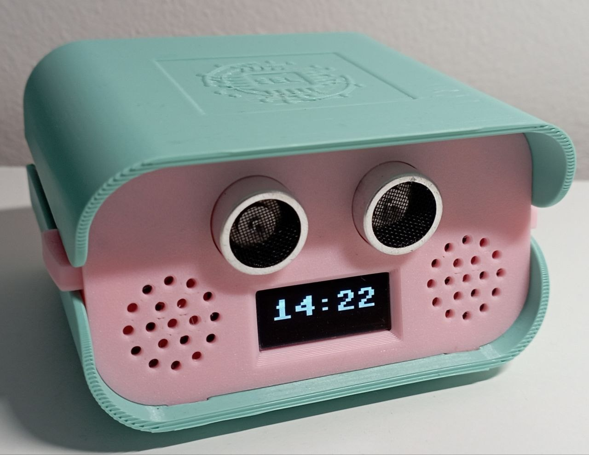
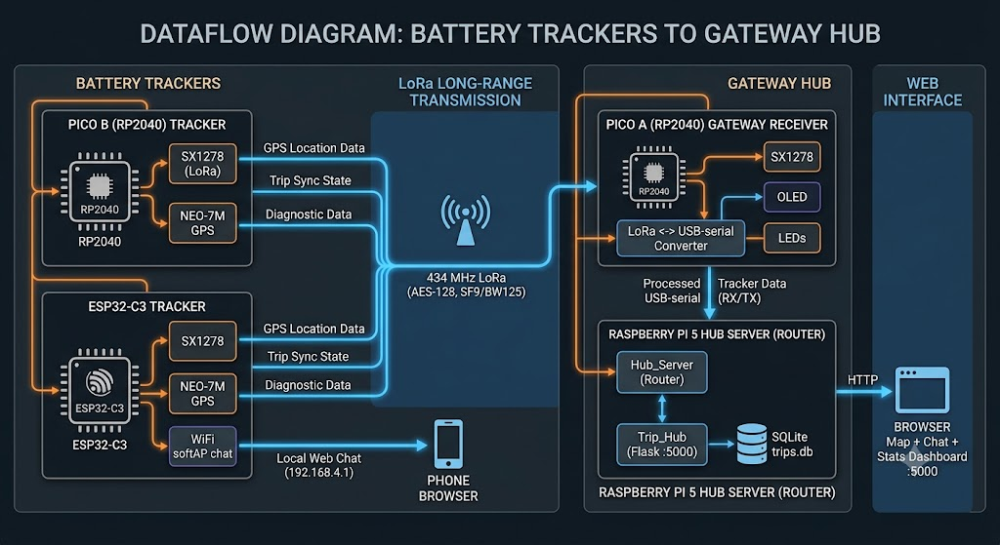

# LoRa GPS Mesh — off-grid trackers, chat & a live map dashboard

         

> A self-contained LoRa mesh that tracks GPS journeys, detects trips, relays
> chat, and reports device health — **with no internet, SIM card or cellular
> anywhere in the data path** — then visualises everything on a web map. This is cheap to build and easy to use.

<p align="center">
  
</p>

<p align="center">
  <em>The Trip Hub dashboard: show a live location, store a trip data points and build polinlines for 3 different types of movement, show stats, has an embedded chat panel with encripted comunication and live device-presence dots — fed entirely by 434 MHz LoRa radio. Support multiple devices with all actions logging</em>
</p>

---

## Why this exists

This is a working reference design for a question clients ask all the time:

> *“I want GPS tracking and a bit of messaging over long range, off the grid,
> shown on a web page — what can you actually build?”*

This repo is the answer, end to end: **four heterogeneous devices** speaking one
encrypted LoRa protocol, a Raspberry Pi gateway (or almost any other Linux OS), and **two web interfaces**
(an on-device captive chat UI and a full map/analytics dashboard). It’s built
from inexpensive, off-the-shelf modules and documents every wire format,
pinout and design decision so you can lift any piece into your own product.

It deliberately spans **three different runtimes** — Arduino C++, MicroPython
and CPython — to show the same radio protocol implemented natively on each, and
how a mixed fleet interoperates.

---

## Highlights

- 📡 **Long-range, license-free radio.** SX127x LoRa @ 434 MHz, SF9/BW125 —
  kilometres of range at a few hundred bits/s, no infrastructure.
- 🔒 **Encrypted on the air.** AES-128 on every packet; same key across the fleet.
- 🛰️ **GPS trip detection.** On-device state machine classifies walking /
  cycling / driving, detects start & stop, and logs dense tracks to flash.
- 🔁 **Store-and-forward sync.** Trackers buffer trips offline and stream them
  to the hub over a reliable query/response protocol when back in range.
- 💬 **Chat over LoRa.** Phone → on-device web UI → LoRa → hub, and back.
- 🟢 **Live device presence.** Every node heartbeats once a minute; the fleet
  (and both web UIs) shows who’s online, with signal strength.
- 🗺️ **Web dashboard.** Leaflet map of every journey, speed analytics, an
  activity log of raw radio traffic, and the chat panel — served from a Pi.
- 🧩 **Three runtimes, one protocol.** Arduino C++ (ESP32-C3), MicroPython
  (RP2040), CPython (Pi) — fully interoperable.

---

## The device lineup

| Device | Role | MCU / Host | Runtime | Radio | GPS | Web | Docs |
|---|---|---|---|---|---|---|---|
| **ESP32-C3 node** | GPS tracker **+ on-device WiFi chat UI** | ESP32-C3 | Arduino C++ | SX1278 | ✅ NEO-7M | ✅ softAP | [docs/esp32-c3.md](docs/esp32-c3.md) |
| **Pico B** | Battery GPS tracker (reference node) | RP2040 | MicroPython | SX1278 | ✅ NEO-7M | — | [docs/pico-b.md](docs/pico-b.md) |
| **Pico A** | LoRa ↔ Pi **bridge** + OLED hub UI | RP2040 | MicroPython | SX1278 | — | — | [docs/pico-a-bridge.md](docs/pico-a-bridge.md) |
| **Raspberry Pi 5** | Gateway server + **Trip Hub** web app | Pi 5 | CPython 3 | (via Pico A) | — | ✅ :5000 | [docs/trip-hub.md](docs/trip-hub.md) |

Each device is independently useful and documented as a standalone building
block. Pick the tracker, the bridge, the dashboard — or the whole stack.

### 3D-printed cases

Custom **Fusion 360** enclosures — print files (STL/3MF) on **Printables**
(links coming soon):

- **Pico A bridge** — pictured below; the two “eyes” are the HC-SR04 ultrasonic
  sensor (proximity wakes the OLED clock). 🔗 **Printables:** _coming soon_
- **ESP32-C3 tracker (AAA battery)** — _work in progress_; off-grid tracker with a
  AAA-battery compartment. 🔗 **Printables:** _coming soon_

<p align="center">
  
  
</p>
<p align="center"><sub>Left: Pico A bridge case · Right: ESP32-C3 AAA tracker case (WIP)</sub></p>

---

## How it fits together

<p align="center">
  
</p>

- **Trackers** (Pico B, ESP32-C3) broadcast GPS, detect trips, and store them.
- **Pico A** is the only radio attached to the Pi: it bridges LoRa ⇄ USB serial,
  encrypting/decrypting and routing every packet, and drives a local OLED/LED UI.
- **Pi 5** runs `Hub_Server` (classifies and routes incoming traffic, drives the
  trip-sync protocol, persists to SQLite) and `Trip_Hub` (the Flask web app).

Full data-flow walkthrough: **[docs/architecture.md](docs/architecture.md)**.

---

## Communication protocols

Everything on the air is one of a small set of tagged, AES-encrypted text
payloads. A one-line taste:

| Prefix | Meaning |
|---|---|
| `GPS:` | periodic position broadcast (live map dot) |
| `TRIPSTART:` / `TRIPEND:` | trip lifecycle with metadata |
| `SYNC:` `QTRIPS:`/`RTRIPS:` `QTRIP:`/`RTRIP:` `QPTS:`/`RPTS:` `ACK:` | store-and-forward **trip sync** query/response |
| `CHAT:` | user chat message |
| `DEVICE:` | identity announce **+ 1-minute liveness heartbeat** |

Radio: **SX1276/78, 434.0 MHz, SF9, BW 125 kHz, CR 4/5, sync 0x34, CRC on,
preamble 8.** Crypto: **AES-128-ECB, PKCS7, 250 B max post-encryption.** The
USB-serial grammar between Pi and Pico A, the delta-compressed GPS fix packing,
and the full sync state machine are documented in
**[docs/protocols.md](docs/protocols.md)**.

You can watch the live protocol traffic in the dashboard’s Activity Log:

<p align="center">
  
</p>

---

## Screenshots

| Live map & journeys | Chat + presence | Protocol activity log |
|---|---|---|
| [](docs/assets/trip-hub-map.png) | [](docs/assets/trip-hub-chat.png) | [](docs/assets/trip-hub-activity-log.png) |

And the **on-device ESP32 chat UI** — served from the tracker’s own WiFi softAP,
no Pi or internet — showing the live device-presence strip (`HubServer 7/10`):

<p align="center">
  
</p>

Full connect→chat walkthrough in **[docs/web-interfaces.md](docs/web-interfaces.md)**.

---

## Hardware

Built entirely from low-cost, widely available modules:

| Part | Used by | Docs / datasheet |
|---|---|---|
| **Ai-Thinker Ra-01 (SX1278)** LoRa | all nodes | [SX1278 product page](https://www.semtech.com/products/wireless-rf/lora-connect/sx1278) |
| **u-blox NEO-7M** GPS | trackers | [NEO-7 product page](https://www.u-blox.com/en/product/neo-7-series) |
| **ESP32-C3** (SuperMini) | ESP32 node | [ESP32-C3 product page](https://www.espressif.com/en/products/socs/esp32-c3) |
| **Raspberry Pi Pico (RP2040)** | Pico A / Pico B | [Raspberry Pi Pico](https://www.raspberrypi.com/products/raspberry-pi-pico/) |
| **Raspberry Pi 5** | gateway | [Raspberry Pi 5](https://www.raspberrypi.com/products/raspberry-pi-5/) |
| SSD1306 OLED, buttons, LEDs, DS1302 RTC | Pico A hub UI | — |

Full bill of materials, **wiring tables and pinouts** per device:
**[docs/hardware.md](docs/hardware.md)** — which also lists the **3D-printed
enclosures** (Fusion 360; Printables links coming soon) for the Pico A bridge and
a AAA-battery ESP32-C3 tracker.

---

## Quick start

> ⚠️ **Demo credentials.** This branch ships placeholder secrets (LoRa AES key
> `LoRaMeshDemoKey1`, WiFi password `ChangeMe-LoRa24`). **Change them before any
> real deployment** and keep the same AES key on every node — see
> [SECURITY.md](SECURITY.md).

### ESP32-C3 node (Arduino C++ / PlatformIO)
```bash
cd ESP32_C3
pio run -t upload          # build + flash over USB
# then join WiFi "LoraWan" and open http://192.168.4.1
```

### Pico A bridge / Pico B tracker (MicroPython)
```bash
# copy the project files to the Pico's flash, e.g. with mpremote:
mpremote connect <PORT> fs cp *.py :
mpremote connect <PORT> reset
```

### Raspberry Pi 5 gateway + dashboard (Python 3)
```bash
# 1. the LoRa<->serial router (talks to Pico A on /dev/ttyACM0)
cd Hub_Server   && python3 hub.py --server http://localhost:5000

# 2. the web dashboard
cd Trip_Hub     && python3 trip_server.py    # http://<pi-ip>:5000
```

Per-device build/run details live in each device’s doc page.

---

## Developer guide & tooling

Hands-on workflow for the fleet — connect, flash, read device data, inspect the
SQLite database, deploy to the bridge, capture dashboard screenshots:
**[docs/development.md](docs/development.md)**.

Sanitised dev scripts (dashboard screenshots, DB inspection, serial reader,
GPS-quality diagnostics) live in **[scripts/](scripts/)** — all driven by args /
env vars, no baked-in credentials.

---

## Repository layout

```
ESP32_C3/              Arduino C++ firmware — tracker + WiFi chat UI (PlatformIO)
PicoB/                 MicroPython — battery GPS tracker (reference node)
Hub_Server_Firmware/   MicroPython — Pico A LoRa<->serial bridge + OLED UI
Hub_Server/            Python 3 — Pi-side router, trip-sync engine, chat DB
Trip_Hub/              Python 3 — Flask map/chat/stats web app + SQLite
scripts/               Developer tooling (screenshots, DB inspect, serial, diagnostics)
docs/                  Architecture, protocols, hardware, developer guide, per-device guides
docs/assets/           Screenshots & images
```

Each top-level folder has its own `CLAUDE.md` with deeper, device-specific notes.

---

## What this repo demonstrates

For prospective clients, this is a portfolio of capabilities you can commission:

- Long-range, low-power, **infrastructure-free** telemetry (LoRa, not LoRaWAN —
  a private point-to-point/mesh protocol you fully own).
- **Application-layer encryption** on constrained MCUs.
- **GPS sensor fusion & motion classification** on-device (hysteresis,
  doppler-spike rejection, trip state machines).
- **Reliable store-and-forward** over a lossy link (offline buffering, batched
  delta-compressed transfer, ACK + retry, idempotent recovery).
- **Mixed-fleet interoperability** across C++, MicroPython and CPython.
- **Edge web UIs** (captive softAP) **and** a **cloud-free gateway dashboard**.
- Clean **device-identity & presence** management (rename-proof hardware IDs,
  heartbeats, signal-strength reporting).

---

## License

**PolyForm Noncommercial License 1.0.0** — see [LICENSE](LICENSE). Free for any
**noncommercial** use (personal, hobby, research, education, non-profits).
**Commercial use requires a separate license** from the author. Hardware names
and datasheets belong to their respective owners; links are for convenience.

---

<sub>Built as a demonstration of practical LoRa + GPS + web engineering.
Questions, or want something like this for your product? Open an issue.</sub>
