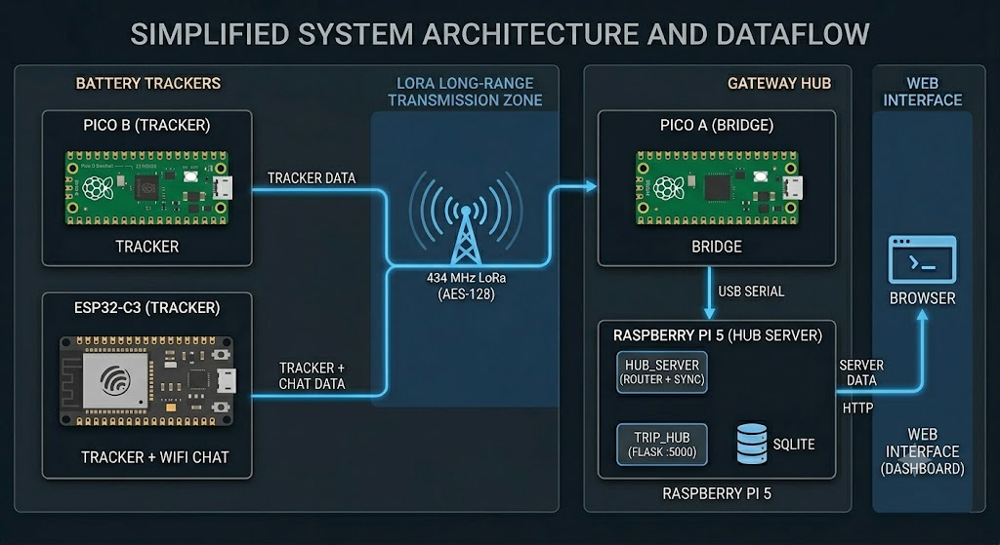

# Architecture

How the four devices, two web UIs and one database fit together — and how a
GPS fix, a trip, a chat message and a heartbeat each travel through the system.

> See also: [protocols.md](protocols.md) for the exact wire formats,
> [hardware.md](hardware.md) for the parts and wiring.

## Nodes & responsibilities

<p align="center">
  
</p>

| Node | What it owns |
|---|---|
| **Pico B** | Battery tracker. GPS cadence, trip detection, on-flash trip log, store-and-forward sync. The *behavioural reference* the others mirror. |
| **ESP32-C3** | Same tracker role **plus** a WiFi softAP + on-device web chat UI so a phone can chat over LoRa with no Pi present. |
| **Pico A** | The fleet’s only radio attached to the Pi. Encrypts/decrypts, routes every LoRa packet to/from the Pi over USB serial, and drives a local OLED/LED/buzzer UI. |
| **Pi 5 · Hub_Server** | Classifies incoming traffic (GPS / trip / chat / sync / device), drives the trip-sync query/response engine, persists to SQLite, POSTs live data to Trip_Hub. |
| **Pi 5 · Trip_Hub** | Flask web app: Leaflet map, speed analytics, activity log, chat panel, device presence. Reads/writes the same SQLite DB. |

## The four data flows

### 1. Live position (`GPS:`)
```
tracker --GPS:{hwid,lat,lon,ts}--> (LoRa) --> Pico A --RX:--> Hub_Server
        --> splitter --> gps.log + HTTP POST /api/live_point --> Trip_Hub
        --> live_points table --> map "live dot"
```
Trackers broadcast a minimal position at a cadence chosen by movement class
(idle 60 s → driving 10 s). The hub never blocks on this; it just logs + forwards.

### 2. Trips (detect → store → sync)
A tracker runs an IDLE↔MOVING state machine. On stop-detect it finalises a trip
(distance, duration, avg/max speed, classification) and writes `.gps` (one fix
per line) + `.json` metadata to flash. Then it announces it has data, and the
**Pi pulls it** with a query/response handshake:

```
tracker: SYNC:<hwid>                         "I have unsent trips"
Pi  →    QTRIPS:<hwid>                        "list them"
tracker: RTRIPS:<hwid>:T123:88,T456:42        ids + point counts
Pi  →    QTRIP:T123                           "metadata for T123"
tracker: RTRIP:T123:{json}                    start/end/km/dur/type/...
Pi  →    QPTS:T123:0:11                        "points 0..11"
tracker: RPTS:T123:0:[[..delta-encoded..]]    a batch of fixes
   ... repeat QPTS/RPTS until all points received ...
Pi  →    ACK:T123                             "stored — you can delete it"
```
This is **reliable over a lossy link**: the Pi drives the cursor, re-requests on
loss, ignores duplicate/stale batches, and only ACKs (which deletes the trip on
the device) once every point is in the DB. See
[protocols.md → Trip sync](protocols.md#trip-sync-store-and-forward).

### 3. Chat (`CHAT:`)
```
phone → ESP32 web UI → CHAT:<sender>:<body> → (LoRa) → Pico A → Hub_Server
      → messages table → Trip_Hub chat panel
Pi → "TX:CHAT:HubServer:<text>" → Pico A → (LoRa) → all nodes
```
The ESP32 also keeps its own RAM+flash ring of the last 50 messages so its UI
works standalone. Pico A keeps the last 20 (persisted across reboot) for its OLED.

### 4. Presence / heartbeat (`DEVICE:`)
Every node re-broadcasts `DEVICE:{"id":<hwid>,"name":<name>}` once a minute.
The Pi treats an unchanged-name announce as a heartbeat and bumps
`devices.last_seen` (+ stores the bridge-heard RSSI). Both web UIs show who’s
online (10-minute window) and signal strength. The same `DEVICE:` message also
carries device renames and boot announces — one mechanism, three jobs. See
[protocols.md → Device identity & presence](protocols.md#device-identity--presence).

## Persistence (SQLite `trips.db`)

Shared by `Hub_Server` and `Trip_Hub`:

| Table | Holds |
|---|---|
| `trips` | one row per journey (times, start/end coords, km, duration, type, speeds, device) |
| `trip_points` | per-fix samples for a trip (lat, lon, ts, cumulative km, speed) |
| `live_points` | real-time `GPS:` broadcasts (the moving “you are here” dots) |
| `messages` | chat history (rx/tx, rssi/snr, source, status) |
| `devices` | identity roster: `id` (hwid) · `name` · `last_seen` · `last_rssi` |
| `journeys` / `journey_trips` | user-grouped multi-trip journeys |

## Process topology on the Pi

Two long-lived services (run under `tmux` in this deployment):

- `hub_server` → `python3 hub.py` — owns `/dev/ttyACM0` (Pico A), routes traffic.
- `trip_hub` → `python3 trip_server.py` — serves `:5000`, reads/writes the DB.

`Hub_Server` POSTs live points / trip events to `Trip_Hub` over local HTTP, so
the two stay decoupled and either can restart independently.
