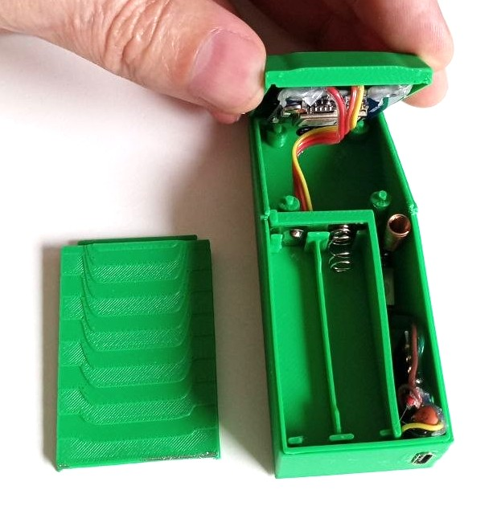

# ESP32-C3 node — GPS tracker + on-device WiFi chat

The most capable node: a LoRa GPS tracker **and** a self-hosted WiFi access point
serving a web chat UI, so a phone can talk over LoRa with no Pi in the loop.

| | |
|---|---|
| **Folder** | [../ESP32_C3/](../ESP32_C3/) |
| **MCU / board** | ESP32-C3 (`esp32-c3-devkitm-1`) |
| **Runtime** | Arduino C++ via **PlatformIO** |
| **Radio / GPS** | SX1278 (RadioLib) · NEO-7M (TinyGPSPlus) |
| **Filesystem** | LittleFS |
| **Pinout** | [hardware.md → ESP32-C3](hardware.md#esp32-c3-node-esp32_c3includeconfigh) |
| **Case** | AAA-battery enclosure — _work in progress_; STL on Printables, _coming soon_ |




## What it does

- **GPS trip detection** — IDLE↔MOVING state machine with start/stop detection,
  speed-class classification (walking/cycling/driving), doppler-spike-hardened
  max speed, and a retroactive motion buffer so a trip’s start coordinate is the
  real departure point.
- **Adaptive GPS cadence** — broadcast interval follows movement class with
  hysteresis (idle 60 s → driving 10 s).
- **On-flash trip log** — `/trips/T<ts>.gps` (one fix per line) + `.json` meta,
  plus `in_progress.txt`. Survives reboots; a trip interrupted by a reset is
  rebuilt from its fixes on next boot.
- **Store-and-forward sync** — answers the Pi’s `QTRIPS/QTRIP/QPTS` queries and
  deletes a trip only on `ACK`.
- **WiFi softAP + web chat** — SSID `LoraWan`, UI at `http://192.168.4.1`; the
  page prepends `CHAT:` and TXes over LoRa. Last 50 messages mirrored to flash.
- **Presence** — broadcasts a `DEVICE:` heartbeat every 60 s and keeps a roster
  of peers it hears, exposed at `/api/devices` and shown as on/offline chips with
  a signal score.

## Source layout ([../ESP32_C3/src/](../ESP32_C3/src/))

| File | Role |
|---|---|
| `main.cpp` | boot, main loop, trip pipeline, RX dispatch, heartbeat |
| `lora_radio.cpp` | RadioLib SX1278 driver + TX/RX |
| `crypto.cpp` | AES-128-ECB + PKCS7 (key from `config.h`) |
| `net.cpp` | WiFi softAP |
| `web_server.cpp` | HTTP chat UI + `/api/messages`, `/api/send`, `/api/devices`, `/api/trips`, `/api/trip` |
| `chat_log.cpp` | RAM ring + LittleFS mirror of chat |
| `gps.cpp` | NMEA → fix struct |
| `trip_tracker.cpp` | trip detection state machine |
| `trip_storage.cpp` | `.gps`/`.json` flash storage + sync state |
| `sync_manager.cpp` | trip-sync responder |
| `sync_codec.cpp` | RPTS delta encode/decode |
| `presence.cpp` | liveness roster (peers + signal) |
| `include/config.h` | **all tunables**: pins, radio params, AES key, WiFi, cadence, trip thresholds |

## HTTP API (behind the softAP, auth-gated)

| Endpoint | Returns |
|---|---|
| `GET /` | chat web UI |
| `GET /api/messages?since=N` | chat messages |
| `POST /api/send` | send a chat message |
| `GET /api/devices` | liveness roster `[{name,hwid,age,online,self,rssi}]` |
| `GET /api/trips` | trips on flash `[{id,npts,sync}]` |
| `GET /api/trip?id=T…` | one trip’s metadata + full fix array |

## Build & flash

```bash
cd ESP32_C3
pio run                 # compile
pio run -t upload       # flash over USB
pio device monitor      # serial @ 115200
```
A plain firmware upload **preserves LittleFS** (your trips/chat survive). Set a
device name at build time with `-DDEVICE_ID=\"C1\"` in `platformio.ini` if needed.

## Gotchas

- After `transmit()` RadioLib leaves the chip in standby — always re-arm
  `startReceive()` (already handled in `lora_radio.cpp`).
- Keep the RadioLib RX ISR tiny (just sets a flag).
- Ra-01 TX current can brown out a weak rail → reset. Decouple well; the boot
  trip-finalizer recovers data either way.
