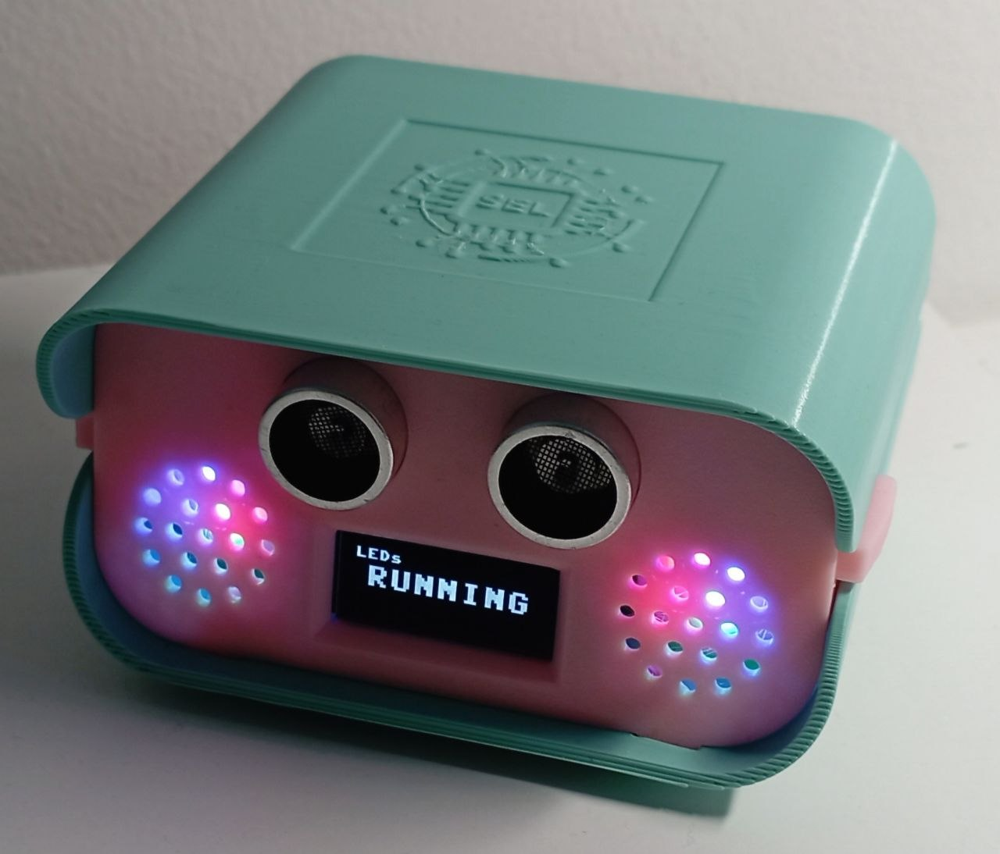
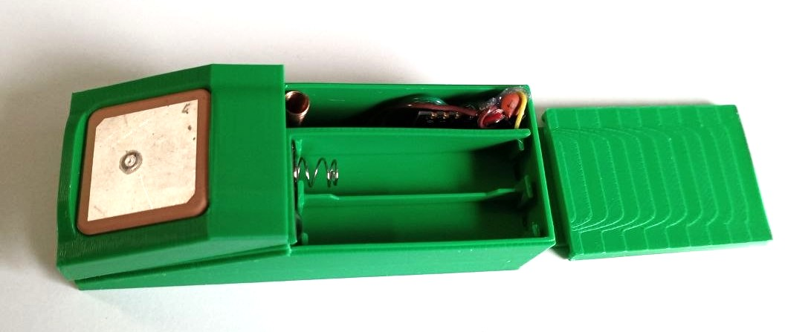

# Hardware

Bill of materials, wiring and pinouts for every node. All parts are common,
inexpensive and widely available.

> Photos: drop your own board shots into `docs/assets/` (suggested names below)
> and they’ll render here. Datasheet/vendor links are provided for each part.

## Bill of materials

| # | Part | Qty | Used by | Link |
|---|---|---|---|---|
| 1 | **Ai-Thinker Ra-01 — Semtech SX1278** LoRa module (433 MHz) | 3 | every radio node | [SX1278](https://www.semtech.com/products/wireless-rf/lora-connect/sx1278) · [Ra-01 docs](https://docs.ai-thinker.com/en/lora) |
| 2 | **u-blox NEO-7M** GPS module | 2 | Pico B, ESP32-C3 | [NEO-7](https://www.u-blox.com/en/product/neo-7-series) |
| 3 | **ESP32-C3 SuperMini** dev board | 1 | ESP32 node | [ESP32-C3](https://www.espressif.com/en/products/socs/esp32-c3) |
| 4 | **Raspberry Pi Pico (RP2040)** | 2 | Pico A, Pico B | [Pico](https://www.raspberrypi.com/products/raspberry-pi-pico/) · [RP2040 datasheet](https://datasheets.raspberrypi.com/rp2040/rp2040-datasheet.pdf) |
| 5 | **Raspberry Pi 5** | 1 | gateway | [Pi 5](https://www.raspberrypi.com/products/raspberry-pi-5/) |
| 6 | **SSD1306** 128×64 I²C OLED | 1 | Pico A UI | [SSD1306](https://cdn-shop.adafruit.com/datasheets/SSD1306.pdf) |
| 7 | **DS1302** RTC | 1 | Pico A clock | [DS1302](https://www.analog.com/media/en/technical-documentation/data-sheets/DS1302.pdf) |
| 8 | HC-SR04 ultrasonic, push buttons, status LEDs, buzzer, power bank | — | Pico A UI / tracker power | — |

LoRa antennas must be rated for **433 MHz**. Run the radios with an antenna
attached — transmitting into no load can damage the PA.

## Pinouts

### ESP32-C3 node ([../ESP32_C3/include/config.h](../ESP32_C3/include/config.h))
| Function | GPIO |
|---|---|
| LoRa SCK / MISO / MOSI / NSS / RST / DIO0 | 4 / 5 / 6 / 7 / 10 / 3 |
| GPS RX / TX (UART → NEO-7M) | 20 / 21 |

### Pico A — bridge / hub ([../Hub_Server_Firmware/config.py](../Hub_Server_Firmware/config.py))
| Function | GPIO |
|---|---|
| LoRa MISO / CS / SCK / MOSI / RST / DIO0 | 16 / 17 / 18 / 19 / 20 / 21 |
| OLED I²C SDA / SCL | 0 / 1 |
| DS1302 CLK / DAT / RST | 2 / 3 / 4 |
| Buzzer | 5 |
| LEDs (G/B/R · R/B/G) | 6,7,8 · 9,10,11 |
| Buttons L / R | 12 / 13 |
| HC-SR04 TRIG / ECHO | 14 / 15 |

### Pico B — battery tracker ([../PicoB/config.py](../PicoB/config.py))
| Function | GPIO |
|---|---|
| LoRa SCK / MOSI / MISO / NSS / RST / DIO0 | 2 / 3 / 4 / 5 / 22 / 26 |
| GPS UART → NEO-7M | per `config.py` |

> Note the two RP2040 boards use **different** LoRa pinouts (Pico A vs Pico B) —
> wire each to its own table.

## Power notes

- The Ra-01 draws **~120 mA on TX**. On the ESP32-C3 especially, decouple VCC/GND
  with **100 nF + 100 µF** close to the module; an under-powered rail causes resets
  mid-transmit (the firmware now recovers interrupted trips on reboot, but clean
  power avoids the resets entirely).
- Pico B is designed to run headless from a USB power bank.

## Enclosures (3D-printed)

Custom cases designed in **Fusion 360** for this project. Print files (STL/3MF)
will be published on **Printables** — links coming soon.

### Pico A bridge case
Enclosure for the Pico A LoRa↔serial bridge (Pico + Ra-01 + OLED/LEDs/buttons).

- 🔗 **Printables:** _coming soon_




### ESP32-C3 tracker case (AAA battery) — _work in progress_
A portable enclosure for the ESP32-C3 node with a **AAA battery** compartment —
fully off-grid GPS tracking. **Work in progress**; print files will be published
on **Printables** (link coming soon).




## Suggested photo filenames (optional)

Drop these into `docs/assets/` to enrich the docs:

```
hw-esp32c3-node.jpg        ESP32-C3 + Ra-01 + NEO-7M wired
hw-picoa-bridge.jpg        Pico A + OLED + LEDs + buttons
hw-picob-tracker.jpg       Pico B battery tracker
hw-pi5-gateway.jpg         Pi 5 with Pico A attached
```
