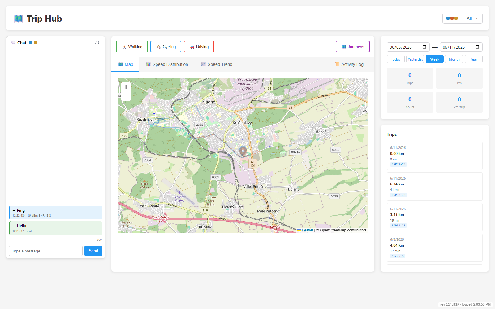
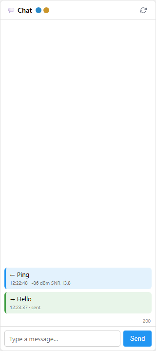
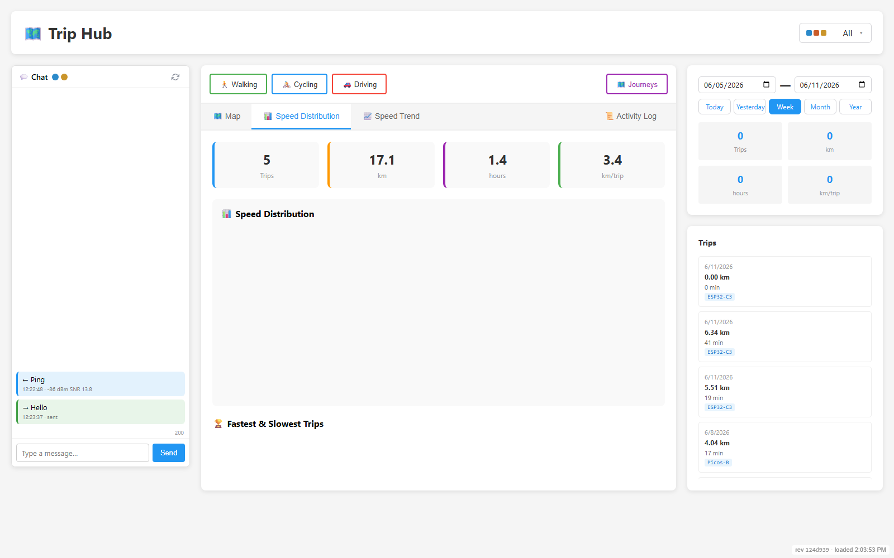
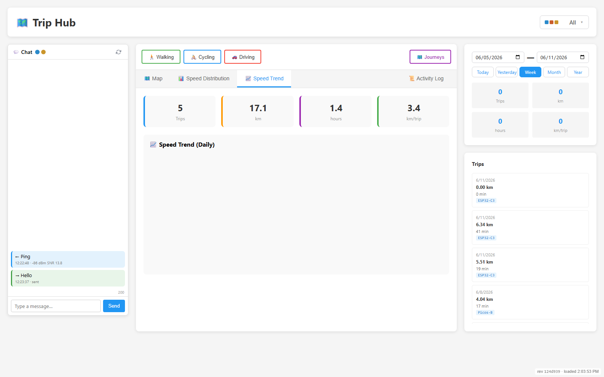
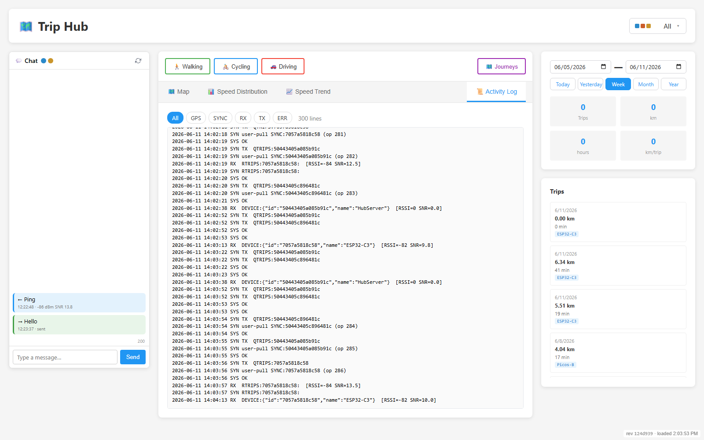
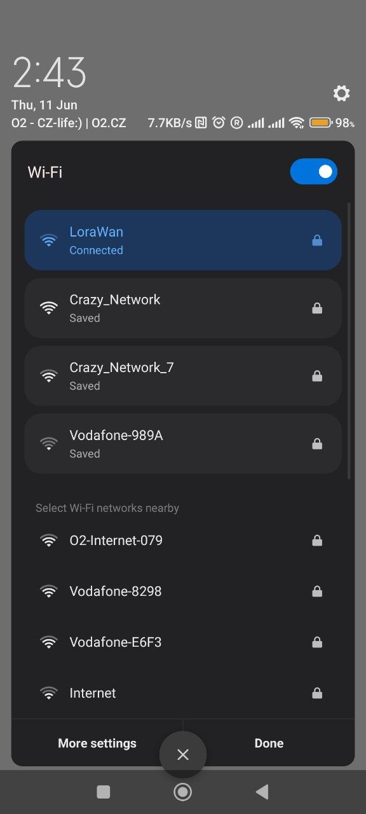
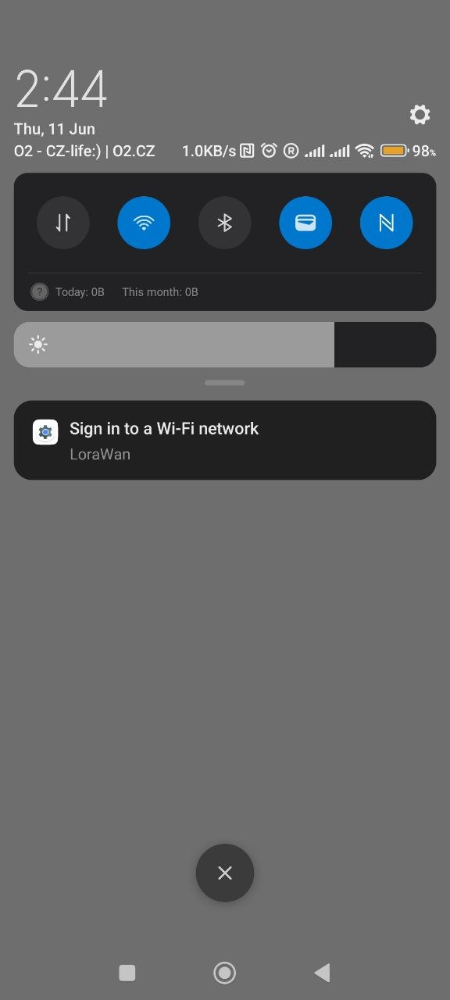
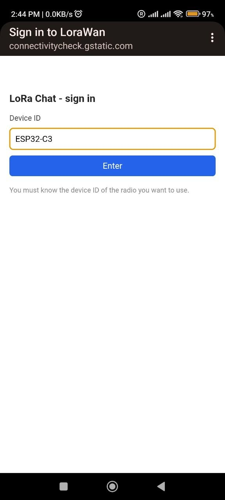
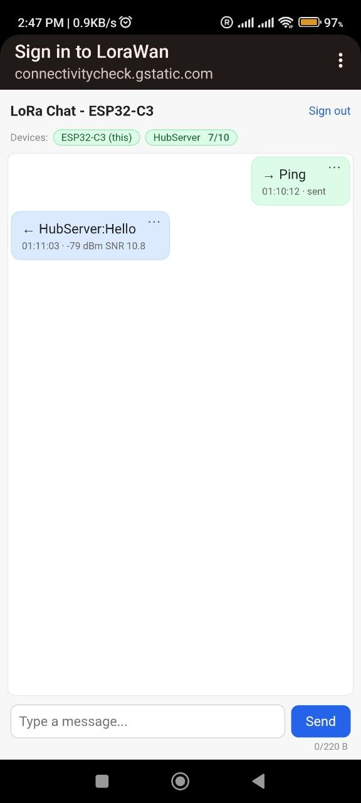

# Web interfaces

Two completely independent web UIs — one served from the Pi gateway, one served
from the ESP32 itself with no Pi required.

---

## Trip Hub dashboard (Pi 5, `http://<pi-ip>:5000`)

A single-page Flask + Leaflet app. Four tabs plus a persistent chat/presence
sidebar and a device-scoped header (profile filter + date range).

### Map & journeys
Trip polylines coloured per movement profile over an OpenStreetMap base, with
per-profile summary tiles and a clickable trip list. Live `GPS:` broadcasts show
as a moving “you are here” dot.

### Chat + device presence
LoRa chat with the fleet, with per-message RSSI/SNR. The dots beside **Chat**
are live presence: coloured = online (heard within 10 min), grey = offline.
Hover a dot for `name - online X/10, last seen …` (the `X/10` is signal strength).

### Speed analytics
**Speed Distribution** and **Speed Trend** tabs render histograms / daily trends
from per-fix speed samples, with summary tiles (trips, km, hours, km/trip).

### Activity log — live protocol traffic
A real-time view of decrypted radio traffic with RSSI/SNR — `DEVICE:` heartbeats,
the `QPTS`/`RPTS`/`ACK` trip-sync cycle, `QTRIPS`/`RTRIPS`, `SYNC`. The best window
into [the protocols](protocols.md).

> Screenshots captured headlessly with Playwright against the live Pi
> (`_capture_shots.py`, kept out of the committed tree). Re-run any time to refresh.

---

## ESP32 on-device chat UI (`http://192.168.4.1`)

Hosted by the ESP32-C3’s own WiFi access point (SSID `LoraWan`) — **no Pi, no
internet**. Join the AP, the captive portal opens a sign-in, enter the device id,
and you’re chatting over LoRa with a live device-presence strip.

| 1 · Join `LoraWan` | 2 · Captive sign-in | 3 · Enter device id | 4 · Chat + presence |
|:---:|:---:|:---:|:---:|
|  |  |  |  |

In the chat view, the **Devices** strip shows `ESP32-C3 (this)` and
`HubServer 7/10` — green = online, and the `X/10` is signal strength (here the
hub is a strong 7/10). Received messages carry their link quality
(`← HubServer:Hello · -79 dBm SNR 10.8`); the send box caps the body at 220 B.
All served straight off the ESP32, no Pi involved.

Endpoints backing this UI:
[esp32-c3.md → HTTP API](esp32-c3.md#http-api-behind-the-softap-auth-gated).
